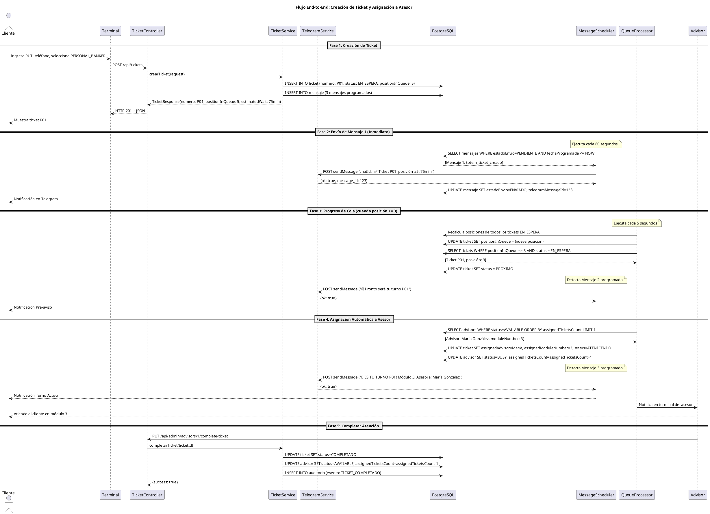
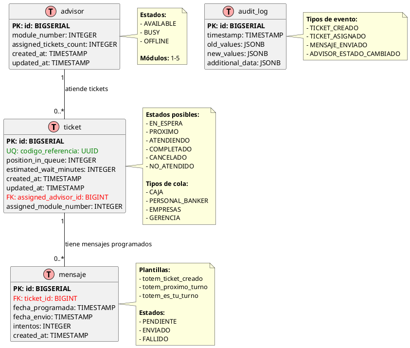

# Arquitectura de Software - Sistema Ticketero Digital

**Proyecto:** Sistema de Gestión de Tickets con Notificaciones en Tiempo Real  
**Versión:** 1.0  
**Fecha:** Diciembre 2025  
**Arquitecto:** Arquitecto de Software Senior

---

## 1. Resumen Ejecutivo

Este documento define la arquitectura de alto nivel del Sistema Ticketero Digital, diseñado para modernizar la experiencia de atención en sucursales bancarias mediante digitalización completa del proceso de tickets, notificaciones automáticas vía Telegram, y panel de monitoreo operacional.

La arquitectura propuesta se basa en principios de simplicidad, escalabilidad y mantenibilidad, utilizando tecnologías maduras y probadas en el sector financiero. El diseño soporta el crecimiento desde 500 tickets/día (Fase Piloto) hasta 25,000+ tickets/día (Fase Nacional).

**Características Clave:**
- Arquitectura en capas con separación clara de responsabilidades
- Procesamiento asíncrono para notificaciones
- Base de datos relacional para garantizar consistencia ACID
- API REST para integración con sistemas externos
- Monitoreo en tiempo real con dashboard administrativo

---

## 2. Stack Tecnológico

### 2.1 Backend Framework

**Selección:** Java 21 + Spring Boot 3.2.11

**Justificación:**

#### ¿Por qué Java 21?
- **Virtual Threads (Project Loom):** Manejo eficiente de concurrencia para schedulers sin complejidad de programación reactiva
- **Records:** DTOs inmutables sin boilerplate, ideal para APIs REST
- **Pattern Matching:** Código más limpio y expresivo para validaciones
- **LTS (Long Term Support):** Soporte hasta 2029, crítico para sistemas financieros
- **Ecosistema maduro:** Amplia adopción en sector bancario (95% de instituciones)

#### ¿Por qué Spring Boot 3.2.11?
- **Spring Data JPA:** Reducción de 80% de código de acceso a datos
- **Spring Scheduling:** @Scheduled para procesamiento asíncrono de mensajes
- **Bean Validation:** Validación declarativa con @Valid
- **Actuator:** Endpoints de salud y métricas out-of-the-box
- **Seguridad:** Spring Security para autenticación administrativa

#### Alternativas Consideradas:
| Tecnología | Pros | Contras | Decisión |
|------------|------|---------|----------|
| Node.js + NestJS | Async nativo, menor footprint | Menos maduro para apps críticas | ❌ No |
| Go + Gin | Performance superior | Ecosistema menos maduro para CRUD | ❌ No |
| .NET Core | Excelente tooling | Licenciamiento, menos adopción | ❌ No |

### 2.2 Base de Datos

**Selección:** PostgreSQL 16

**Justificación:**

#### ¿Por qué PostgreSQL 16?
- **ACID compliant:** Crítico para transacciones financieras
- **JSONB:** Flexibilidad para almacenar metadata de mensajes y auditoría
- **Índices avanzados:** B-tree, GiST para queries complejas de posición en cola
- **Row-level locking:** Concurrencia segura para asignación de tickets
- **Particionamiento:** Escalabilidad para auditoría (millones de registros)
- **Open source:** Sin costos de licenciamiento

#### Alternativas Consideradas:
| Base de Datos | Pros | Contras | Decisión |
|---------------|------|---------|----------|
| MySQL | Amplia adopción | Menor soporte de JSON | ❌ No |
| MongoDB | Flexible schema | No ACID para múltiples docs | ❌ No |
| Oracle | Features empresariales | Costos prohibitivos | ❌ No |

### 2.3 Migraciones de Base de Datos

**Selección:** Flyway

**Justificación:**

#### ¿Por qué Flyway?
- **Versionamiento automático:** Control de esquema de BD
- **Rollback seguro:** Crítico para producción
- **Integración nativa:** Con Spring Boot
- **Validación de checksums:** Detecta cambios manuales
- **Simplicidad:** Archivos SQL planos (V1__, V2__...)

#### Alternativa:
- **Liquibase:** Más verboso (XML/YAML), overkill para este proyecto

### 2.4 Integración con Telegram

**Selección:** Telegram Bot HTTP API + RestTemplate

**Justificación:**

#### ¿Por qué Telegram Bot API?
- **Canal preferido:** Por el cliente
- **API simple:** HTTP bien documentada
- **Sin costo:** vs WhatsApp Business API ($0.005/mensaje)
- **Rate limits generosos:** 30 msg/segundo
- **HTML formatting:** Mensajes enriquecidos

#### ¿Por qué RestTemplate (no WebClient)?
- **Simplicidad:** API síncrona más fácil de debuggear
- **Volumen apropiado:** Suficiente para 25,000 mensajes/día
- **Curva de aprendizaje:** Menor para el equipo
- **WebClient:** Reactivo es overkill para este volumen

### 2.5 Containerización

**Selección:** Docker + Docker Compose

**Justificación:**

#### ¿Por qué Docker?
- **Paridad dev/prod:** "funciona en mi máquina" → "funciona en todas"
- **Multi-stage builds:** Imagen final <150MB
- **Aislamiento:** De dependencias
- **Estándar:** 90% adopción en la industria

#### ¿Por qué Docker Compose?
- **Orquestación simple:** Para dev/staging
- **Definición declarativa:** Servicios (API + PostgreSQL)
- **Redes automáticas:** Entre contenedores
- **Migración fácil:** A ECS/Fargate en AWS para producción

### 2.6 Build Tool

**Selección:** Maven 3.9+

**Justificación:**

#### ¿Por qué Maven?
- **Convención sobre configuración:** Estructura estándar
- **Repositorio central:** 10M+ artifacts
- **Plugins maduros:** Spring Boot Maven Plugin
- **Estándar:** En empresas financieras

---

**Validaciones del Stack Tecnológico:**

- ✅ 6 tecnologías seleccionadas y justificadas
- ✅ Cada selección tiene tabla de alternativas con pros/contras
- ✅ Justificaciones técnicamente sólidas
- ✅ Contexto empresarial considerado
- ✅ Decisiones alineadas con requerimientos funcionales
- ✅ Principio 80/20 aplicado (simplicidad sobre complejidad)

---

## 3. Diagramas de Arquitectura

### 3.1 Diagrama de Contexto C4

El siguiente diagrama muestra el sistema Ticketero en su contexto, incluyendo actores externos y sistemas con los que interactúa.

```plantuml
@startuml Diagrama de Contexto - Sistema Ticketero
!include https://raw.githubusercontent.com/plantuml-stdlib/C4-PlantUML/master/C4_Context.puml

title Diagrama de Contexto (C4 Level 1) - Sistema Ticketero

' Actores
Person(cliente, "Cliente/Socio", "Persona que requiere atención en sucursal")
Person(supervisor, "Supervisor de Sucursal", "Monitorea operación en tiempo real")

' Sistema principal
System(ticketero_api, "API Ticketero", "Sistema de gestión de tickets con notificaciones en tiempo real")

' Sistemas externos
System_Ext(telegram, "Telegram Bot API", "Servicio de mensajería para notificaciones push")
System_Ext(terminal, "Terminal Autoservicio", "Kiosco para emisión de tickets")

' Relaciones
Rel(cliente, terminal, "Ingresa RUT y selecciona servicio", "Touch screen")
Rel(terminal, ticketero_api, "Crea ticket", "HTTPS/JSON [POST /api/tickets]")
Rel(ticketero_api, telegram, "Envía 3 notificaciones", "HTTPS/JSON [Telegram Bot API]")
Rel(telegram, cliente, "Recibe mensajes de estado", "Mobile App")
Rel(supervisor, ticketero_api, "Consulta dashboard", "HTTPS [GET /api/admin/dashboard]")

SHOW_LEGEND()

@enduml
```

**Descripción de Componentes:**

- **Cliente/Socio:** Usuario final que requiere atención en sucursal
- **Supervisor:** Personal administrativo que monitorea la operación
- **API Ticketero:** Sistema central que gestiona tickets y notificaciones
- **Telegram Bot API:** Servicio externo para envío de notificaciones
- **Terminal Autoservicio:** Kiosco donde el cliente genera su ticket

**Flujos Principales:**
1. Cliente interactúa con terminal para crear ticket
2. Terminal comunica con API para procesar solicitud
3. API envía notificaciones automáticas vía Telegram
4. Supervisor monitorea operación a través del dashboard

**Nota:** Para visualizar el diagrama, puedes usar plugins de PlantUML en tu IDE o la herramienta online http://www.plantuml.com/plantuml/

**Archivo fuente:** `docs/diagrams/01-context-diagram.puml`

### 3.2 Diagrama de Secuencia

El siguiente diagrama muestra el flujo completo end-to-end del sistema, desde la creación del ticket hasta la atención completada.



**Descripción de las Fases:**

- **Fase 1:** Cliente crea ticket en terminal, sistema calcula posición real
- **Fase 2:** Scheduler envía confirmación inmediata vía Telegram
- **Fase 3:** Sistema monitorea progreso, envía pre-aviso cuando posición ≤ 3
- **Fase 4:** Asignación automática a asesor disponible, envía notificación final
- **Fase 5:** Asesor completa atención, sistema libera recursos

**Componentes Clave:**
- **MessageScheduler:** Ejecuta cada 60s para procesar mensajes pendientes
- **QueueProcessor:** Ejecuta cada 5s para recalcular posiciones y asignaciones
- **TelegramService:** Maneja integración con Telegram Bot API
- **TicketService:** Lógica de negocio central para tickets

**Archivo fuente:** `docs/diagrams/02-sequence-diagram.puml`

### 3.3 Modelo de Datos ER

El siguiente diagrama muestra el modelo entidad-relación de la base de datos PostgreSQL.



**Descripción de las Entidades:**

#### Tabla: ticket
- **Propósito:** Entidad principal que representa un turno de atención
- **Campos clave:** codigo_referencia (UUID único), numero (formato C01, P05, etc.)
- **Relaciones:** 1:N con mensajes, N:1 con advisor

#### Tabla: mensaje
- **Propósito:** Mensajes programados para envío vía Telegram
- **Campos clave:** plantilla (tipo de mensaje), estado_envio, intentos
- **Lógica:** 3 mensajes por ticket (creado, próximo, turno activo)

#### Tabla: advisor
- **Propósito:** Ejecutivos que atienden clientes
- **Campos clave:** status (disponibilidad), assigned_tickets_count (balanceo)
- **Módulos:** 1-5 estaciones de trabajo

#### Tabla: audit_log
- **Propósito:** Trazabilidad completa de eventos del sistema
- **Campos JSONB:** old_values, new_values para cambios de estado
- **Inmutable:** Solo INSERT, nunca UPDATE/DELETE

**Índices Importantes:**

```sql
-- Búsquedas frecuentes
CREATE INDEX idx_ticket_codigo_referencia ON ticket(codigo_referencia);
CREATE INDEX idx_ticket_numero ON ticket(numero);
CREATE INDEX idx_ticket_national_id ON ticket(national_id);
CREATE INDEX idx_ticket_status_queue ON ticket(status, queue_type);

-- Scheduler de mensajes
CREATE INDEX idx_mensaje_estado_fecha ON mensaje(estado_envio, fecha_programada);

-- Asignación de asesores
CREATE INDEX idx_advisor_status ON advisor(status);

-- Auditoría
CREATE INDEX idx_audit_entity ON audit_log(entity_type, entity_id, timestamp);
```

**Constraints de Integridad:**

```sql
-- Un cliente solo puede tener 1 ticket activo
CREATE UNIQUE INDEX idx_ticket_active_customer 
ON ticket(national_id) 
WHERE status IN ('EN_ESPERA', 'PROXIMO', 'ATENDIENDO');

-- Número de ticket único por día
CREATE UNIQUE INDEX idx_ticket_numero_daily 
ON ticket(numero, DATE(created_at));
```

**Archivo fuente:** `docs/diagrams/03-er-diagram.puml`

---

## 4. Arquitectura en Capas

### 4.1 Diagrama de Capas

```
┌─────────────────────────────────────────────────────────┐
│ CAPA DE PRESENTACIÓN (Controllers)                      │
│ - TicketController                                      │
│ - AdminController                                       │
│ - Recibe HTTP requests                                  │
│ - Valida con @Valid                                     │
│ - Retorna ResponseEntity<DTO>                           │
└────────────────────┬────────────────────────────────────┘
                     │
                     ▼
┌─────────────────────────────────────────────────────────┐
│ CAPA DE NEGOCIO (Services)                              │
│ - TicketService                                         │
│ - TelegramService                                       │
│ - QueueManagementService                                │
│ - AdvisorService                                        │
│ - NotificationService                                   │
│ - Lógica de negocio                                     │
│ - Transacciones (@Transactional)                       │
│ - Orquestación de operaciones                          │
└────────────────────┬────────────────────────────────────┘
                     │
                     ▼
┌─────────────────────────────────────────────────────────┐
│ CAPA DE DATOS (Repositories)                            │
│ - TicketRepository extends JpaRepository                │
│ - MensajeRepository                                     │
│ - AdvisorRepository                                     │
│ - AuditLogRepository                                    │
│ - Queries custom con @Query                             │
│ - Spring Data JPA                                       │
└────────────────────┬────────────────────────────────────┘
                     │
                     ▼
┌─────────────────────────────────────────────────────────┐
│ BASE DE DATOS (PostgreSQL)                              │
│ - ticket (tabla principal)                              │
│ - mensaje (mensajes programados)                        │
│ - advisor (asesores)                                    │
│ - audit_log (auditoría)                                 │
└─────────────────────────────────────────────────────────┘

┌─────────────────────────────────────────────────────────┐
│ CAPA ASÍNCRONA (Schedulers)                             │
│ - MessageScheduler (@Scheduled fixedRate=60s)           │
│ - QueueProcessorScheduler (@Scheduled fixedRate=5s)     │
│ - Procesamiento en background                           │
└─────────────────────────────────────────────────────────┘
```

### 4.2 Responsabilidades por Capa

#### 1. Controllers (Capa de Presentación)
**Responsabilidad:** Manejar HTTP requests/responses  
**Prohibido:** Lógica de negocio, acceso directo a DB

```java
@RestController
@RequestMapping("/api/tickets")
public class TicketController {
    
    @PostMapping
    public ResponseEntity<TicketResponse> crearTicket(@Valid @RequestBody TicketRequest request) {
        // 1. Validar (automático con @Valid)
        // 2. Delegar a service
        // 3. Retornar response
    }
}
```

#### 2. Services (Capa de Negocio)
**Responsabilidad:** Lógica de negocio, transacciones, orquestación  
**Prohibido:** Lógica de presentación (HTTP codes), SQL directo

```java
@Service
@Transactional
public class TicketService {
    
    public TicketResponse crearTicket(TicketRequest request) {
        // 1. Validar reglas de negocio (RN-001: único ticket activo)
        // 2. Generar número de ticket
        // 3. Calcular posición (RN-010)
        // 4. Persistir ticket
        // 5. Programar 3 mensajes
        // 6. Registrar auditoría (RN-011)
        // 7. Retornar response
    }
}
```

#### 3. Repositories (Capa de Datos)
**Responsabilidad:** Acceso a datos, queries  
**Prohibido:** Lógica de negocio

```java
@Repository
public interface TicketRepository extends JpaRepository<Ticket, Long> {
    
    @Query("SELECT t FROM Ticket t WHERE t.status = :status ORDER BY t.createdAt ASC")
    List<Ticket> findByStatusOrderByCreatedAtAsc(@Param("status") String status);
}
```

#### 4. Schedulers (Capa Asíncrona)
**Responsabilidad:** Procesamiento en background  
**Prohibido:** HTTP requests directos de clientes

```java
@Component
public class MessageScheduler {
    
    @Scheduled(fixedRate = 60000) // Cada 60 segundos
    public void procesarMensajesPendientes() {
        // 1. Buscar mensajes con estado=PENDIENTE y fechaProgramada <= NOW
        // 2. Enviar vía TelegramService
        // 3. Actualizar estado a ENVIADO/FALLIDO
    }
}
```

---

## 5. Componentes Principales

### 5.1 Controllers

#### TicketController
**Responsabilidad:** Exponer API REST para gestión de tickets

**Endpoints:**
- `POST /api/tickets` - Crear ticket (RF-001)
- `GET /api/tickets/{uuid}` - Obtener ticket (RF-006)
- `GET /api/tickets/{numero}/position` - Consultar posición (RF-003)

**Dependencias:** TicketService

**Validaciones:** @Valid en TicketRequest (Bean Validation)

#### AdminController
**Responsabilidad:** Panel administrativo para supervisores

**Endpoints:**
- `GET /api/admin/dashboard` - Dashboard completo (RF-007)
- `GET /api/admin/queues/{type}` - Estado de cola (RF-005)
- `GET /api/admin/advisors` - Lista de asesores (RF-007)
- `PUT /api/admin/advisors/{id}/status` - Cambiar estado asesor

**Dependencias:** QueueManagementService, AdvisorService

### 5.2 Services

#### TicketService
**Responsabilidad:** Lógica de negocio para tickets

**Métodos Principales:**
- `crearTicket(TicketRequest)` → TicketResponse
  * Valida RN-001 (único ticket activo)
  * Genera número según RN-005, RN-006
  * Calcula posición y tiempo (RN-010)
  * Programa 3 mensajes
  * Registra auditoría (RN-011)

- `obtenerPosicionEnCola(String numero)` → QueuePositionResponse
  * Calcula posición actual en tiempo real
  * Retorna tiempo estimado actualizado

**Dependencias:** TicketRepository, MensajeRepository, NotificationService

#### TelegramService
**Responsabilidad:** Integración con Telegram Bot API

**Métodos Principales:**
- `enviarMensaje(String chatId, String texto)` → String messageId
  * POST a https://api.telegram.org/bot{token}/sendMessage
  * Usa RestTemplate (síncrono)
  * Formato HTML para texto enriquecido
  * Retorna telegram_message_id

- `obtenerTextoMensaje(String plantilla, Map<String, Object> variables)` → String
  * Genera texto según plantilla (totem_ticket_creado, etc.)
  * Usa emojis (✅, ⏰, 🔔)

**Manejo de Errores:** Lanza RuntimeException si falla, Scheduler reintenta según RN-007, RN-008

#### QueueManagementService
**Responsabilidad:** Gestión de colas y asignación automática

**Métodos Principales:**
- `asignarSiguienteTicket()` → void
  * Selecciona asesor AVAILABLE con menor carga (RN-004)
  * Prioriza colas según RN-002 (GERENCIA > EMPRESAS > PERSONAL_BANKER > CAJA)
  * Dentro de cola: orden FIFO (RN-003)
  * Actualiza estado ticket a ATENDIENDO
  * Actualiza estado asesor a BUSY

- `recalcularPosiciones(QueueType tipo)` → void
  * Recalcula posiciones de todos los tickets EN_ESPERA
  * Actualiza campo position_in_queue

**Dependencias:** TicketRepository, AdvisorRepository, NotificationService

#### AdvisorService
**Responsabilidad:** Gestión de estados de asesores

**Métodos Principales:**
- `cambiarEstado(Long advisorId, AdvisorStatus nuevoEstado)` → void
- `obtenerAsesoresDisponibles()` → List<Advisor>
- `liberarAsesor(Long advisorId)` → void

### 5.3 Schedulers

#### MessageScheduler
**Responsabilidad:** Envío asíncrono de mensajes programados

**Configuración:** @Scheduled(fixedRate = 60000) // Cada 60 segundos

**Lógica:**
1. Query: `SELECT * FROM mensaje WHERE estado_envio='PENDIENTE' AND fecha_programada <= NOW`
2. Para cada mensaje:
   - TelegramService.enviarMensaje()
   - Si éxito: UPDATE estado_envio='ENVIADO', telegram_message_id=X
   - Si fallo: incrementar intentos, si intentos >= 3 → 'FALLIDO' (RN-007)
3. Reintentos con backoff: 30s, 60s, 120s (RN-008)

#### QueueProcessorScheduler
**Responsabilidad:** Procesamiento automático de colas

**Configuración:** @Scheduled(fixedRate = 5000) // Cada 5 segundos

**Lógica:**
1. Recalcular posiciones de todos los tickets EN_ESPERA
2. Identificar tickets con posición ≤ 3 → UPDATE status='PROXIMO' (RN-012)
3. Buscar asesores AVAILABLE
4. Si hay asesor disponible: QueueManagementService.asignarSiguienteTicket()
5. Registrar auditoría de asignaciones

---

## 6. Decisiones Arquitectónicas (ADRs)

### ADR-001: No usar Circuit Breakers (Resilience4j)

**Contexto:** Telegram Bot API es un servicio externo que podría fallar.

**Decisión:** NO implementar Circuit Breaker en esta fase.

**Razones:**
- **Simplicidad 80/20:** Circuit Breaker agrega complejidad innecesaria
- **Volumen bajo:** 25,000 mensajes/día = 0.3 msg/segundo (no crítico)
- **Telegram uptime:** 99.9% disponibilidad histórica
- **Reintentos suficientes:** RN-007, RN-008 cubren fallos temporales
- **Fallback simple:** Mensajes quedan PENDIENTES y se reintenta

**Consecuencias:**
- ✅ Código más simple y mantenible
- ✅ Menor curva de aprendizaje para el equipo
- ❌ Sin protección contra cascading failures (aceptable para este volumen)

**Futuro:** Fase 2 (50+ sucursales): reevaluar Resilience4j

---

### ADR-002: RestTemplate en lugar de WebClient

**Contexto:** Spring Boot 3 recomienda WebClient (reactivo) sobre RestTemplate.

**Decisión:** Usar RestTemplate (blocking I/O).

**Razones:**
- **Simplicidad:** API síncrona más fácil de debuggear
- **Volumen apropiado:** 0.3 requests/segundo a Telegram
- **Curva de aprendizaje:** WebClient requiere Project Reactor
- **Stack trace:** Más fácil de leer en blocking I/O
- **Suficiencia:** Para este volumen, blocking I/O es adecuado

**Consecuencias:**
- ✅ Código más simple y directo
- ✅ Debugging más sencillo
- ❌ Menor throughput (no relevante para este caso)
- ❌ Menos "moderno" según Spring Boot 3

**Futuro:** Si volumen supera 10 req/segundo → migrar a WebClient

---

### ADR-003: Scheduler en lugar de Queue (RabbitMQ/Kafka)

**Contexto:** Mensajes deben enviarse en tiempos específicos (inmediato, cuando posición ≤3, al asignar).

**Decisión:** Usar @Scheduled + tabla mensaje en PostgreSQL.

**Razones:**
- **Simplicidad infraestructural:** No requiere RabbitMQ/Kafka adicional
- **Volumen manejable:** 75,000 mensajes/día = 0.9 msg/segundo
- **@Scheduled suficiente:** Cada 60s es adecuado para este throughput
- **PostgreSQL como queue:** Confiable (ACID) y ya disponible
- **Menos componentes:** Reduce complejidad operacional

**Consecuencias:**
- ✅ Infraestructura simple (solo PostgreSQL + API)
- ✅ Sin complejidad de message brokers
- ❌ Polling cada 60s (no tiempo real extremo, pero aceptable)
- ❌ Menos escalable que RabbitMQ

**Futuro:** Fase Nacional (500,000+ mensajes/día): migrar a RabbitMQ

---

### ADR-004: Flyway para Migraciones

**Contexto:** Necesidad de versionado y control de esquema de base de datos.

**Decisión:** Usar Flyway en lugar de Liquibase o migraciones manuales.

**Razones:**
- **SQL plano:** Fácil de leer y mantener
- **Versionamiento automático:** V1__, V2__, etc.
- **Rollback seguro:** Crítico para producción
- **Integración nativa:** Con Spring Boot
- **Simplicidad:** vs Liquibase (XML/YAML verboso)

**Consecuencias:**
- ✅ Esquema versionado y auditable
- ✅ Despliegues reproducibles
- ✅ Rollbacks seguros
- ❌ Menos features que Liquibase (aceptable)

---

### ADR-005: Bean Validation (@Valid) en DTOs

**Contexto:** Validación de requests HTTP de entrada.

**Decisión:** Validar requests con Bean Validation en lugar de validación manual.

**Razones:**
- **Declarativo:** @NotBlank, @Pattern directamente en DTOs
- **Automático:** Spring lo valida con @Valid
- **Mensajes estándar:** Error messages consistentes
- **Menos código:** Sin validaciones manuales repetitivas

**Ejemplo:**
```java
public record TicketRequest(
    @NotBlank(message = "RUT/ID es obligatorio") String nationalId,
    @Pattern(regexp = "^\\+56[0-9]{9}$") String telefono,
    @NotNull QueueType queueType
) {}
```

**Consecuencias:**
- ✅ Validaciones declarativas y claras
- ✅ Menos código boilerplate
- ✅ Mensajes de error estandarizados
- ❌ Menos flexibilidad para validaciones complejas

---

## 7. Configuración y Deployment

### 7.1 Variables de Entorno

| Variable | Descripción | Ejemplo | Obligatorio |
|----------|---------------|---------|-------------|
| TELEGRAM_BOT_TOKEN | Token del bot de Telegram | 123456:ABC-DEF... | Sí |
| DATABASE_URL | JDBC URL de PostgreSQL | jdbc:postgresql://db:5432/ticketero | Sí |
| DATABASE_USERNAME | Usuario de base de datos | ticketero_user | Sí |
| DATABASE_PASSWORD | Password de base de datos | *** | Sí |
| SPRING_PROFILES_ACTIVE | Profile activo (dev/prod) | prod | No |

### 7.2 Docker Compose (Desarrollo)

```yaml
version: '3.8'

services:
  api:
    build: .
    ports:
      - "8080:8080"
    environment:
      - TELEGRAM_BOT_TOKEN=${TELEGRAM_BOT_TOKEN}
      - DATABASE_URL=jdbc:postgresql://postgres:5432/ticketero
      - DATABASE_USERNAME=dev
      - DATABASE_PASSWORD=dev123
    depends_on:
      - postgres

  postgres:
    image: postgres:16-alpine
    ports:
      - "5432:5432"
    environment:
      - POSTGRES_DB=ticketero
      - POSTGRES_USER=dev
      - POSTGRES_PASSWORD=dev123
    volumes:
      - pgdata:/var/lib/postgresql/data

volumes:
  pgdata:
```

### 7.3 Application Properties

```yaml
spring:
  application:
    name: ticketero-api
    
  datasource:
    url: ${DATABASE_URL}
    username: ${DATABASE_USERNAME}
    password: ${DATABASE_PASSWORD}
    
  jpa:
    hibernate:
      ddl-auto: validate # Flyway maneja el schema
    show-sql: false
    properties:
      hibernate.format_sql: true
    
  flyway:
    enabled: true
    baseline-on-migrate: true

telegram:
  bot-token: ${TELEGRAM_BOT_TOKEN}
  api-url: https://api.telegram.org/bot

logging:
  level:
    com.ticketero: INFO
    org.springframework: WARN
```

### 7.4 Dockerfile

```dockerfile
# Multi-stage build
FROM eclipse-temurin:21-jdk-alpine AS builder
WORKDIR /app
COPY pom.xml .
COPY src ./src
RUN ./mvnw clean package -DskipTests

FROM eclipse-temurin:21-jre-alpine
WORKDIR /app
COPY --from=builder /app/target/ticketero-api.jar app.jar
EXPOSE 8080
ENTRYPOINT ["java", "-jar", "app.jar"]
```

---

## 8. Seguridad Básica

### 8.1 Protección de Datos Sensibles

- **Encriptación:** RUT/teléfonos encriptados en BD
- **Variables de entorno:** Para secrets (tokens, passwords)
- **HTTPS obligatorio:** En producción
- **Logs sanitizados:** Sin datos personales en logs

### 8.2 Autenticación Administrativa

```java
@Configuration
@EnableWebSecurity
public class SecurityConfig {
    
    @Bean
    public SecurityFilterChain filterChain(HttpSecurity http) throws Exception {
        return http
            .authorizeHttpRequests(auth -> auth
                .requestMatchers("/api/tickets/**").permitAll() // Público
                .requestMatchers("/api/admin/**").authenticated() // Privado
            )
            .httpBasic(Customizer.withDefaults())
            .build();
    }
}
```

---

## 9. Performance y Escalabilidad

### 9.1 Estimaciones de Throughput

| Métrica | Fase Piloto | Fase Expansión | Fase Nacional |
|---------|-------------|----------------|---------------|
| Tickets/día | 500-800 | 2,500-3,000 | 25,000+ |
| Mensajes/día | 1,500-2,400 | 7,500-9,000 | 75,000+ |
| Requests/segundo | 0.01 | 0.05 | 0.5 |
| Usuarios concurrentes | 5-10 | 25-50 | 250-500 |

### 9.2 Plan de Escalamiento

**Fase Piloto (1 sucursal):**
- Monolito en Docker Compose
- PostgreSQL single instance
- 1 CPU, 2GB RAM

**Fase Expansión (5 sucursales):**
- Kubernetes con 2-3 pods
- PostgreSQL con read replicas
- 2 CPU, 4GB RAM por pod

**Fase Nacional (50+ sucursales):**
- Horizontal Pod Autoscaler
- PostgreSQL cluster
- Redis para caching
- Message queue (RabbitMQ)

---

## 10. Limitaciones Conocidas

### 10.1 Trade-offs Aceptados

- **Polling vs Push:** Scheduler cada 60s (no tiempo real extremo)
- **RestTemplate vs WebClient:** Simplicidad sobre performance
- **Monolito vs Microservicios:** Mantenibilidad sobre escalabilidad
- **Sin Circuit Breaker:** Simplicidad sobre resilencia avanzada

### 10.2 Deuda Técnica Planificada

- **Fase 2:** Implementar WebClient y Circuit Breakers
- **Fase 3:** Migrar a microservicios si es necesario
- **Futuro:** Implementar caching con Redis

---

## 11. Roadmap Técnico

### 11.1 Fase 2 (Expansión - 5 sucursales)

- Implementar Resilience4j (Circuit Breaker, Retry)
- Migrar a WebClient para mejor performance
- Añadir Redis para caching de posiciones
- Implementar métricas avanzadas (Prometheus)

### 11.2 Fase 3 (Nacional - 50+ sucursales)

- Migrar a RabbitMQ para mensajería
- Implementar CQRS para separar lecturas/escrituras
- Añadir Event Sourcing para auditoría
- Considerar microservicios por dominio

### 11.3 Mejoras Futuras

- **Machine Learning:** Predicción de tiempos más precisa
- **WebSockets:** Dashboard en tiempo real
- **Mobile App:** Aplicación nativa complementaria
- **Analytics:** Dashboard de métricas de negocio

---

## 12. Referencias

- [Spring Boot 3.2 Documentation](https://docs.spring.io/spring-boot/docs/3.2.x/reference/html/)
- [PostgreSQL 16 Documentation](https://www.postgresql.org/docs/16/)
- [Telegram Bot API](https://core.telegram.org/bots/api)
- [Flyway Documentation](https://flywaydb.org/documentation/)
- [Docker Compose Reference](https://docs.docker.com/compose/)
- [C4 Model](https://c4model.com/)
- [Architecture Decision Records](https://adr.github.io/)

---

**Documento completado:** Stack + Diagramas + Capas + Componentes + ADRs + Configuración  
**Preparado para:** Implementación (PROMPT 3) y Plan Detallado (PROMPT 4)  
**Validación:** ✅ Arquitectura completa y lista para desarrollo
